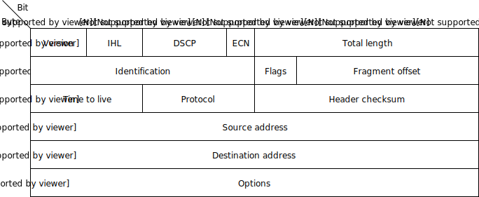

# What is IoT

## What is IoT

* Not "a computer connected to the internet"
    * Then it is really just another computer connected to the internet

* Must be something else
    * It is simply devices that are resource constrained
        * Usually in more than one way

* Autonomous operation, the connection might not be permanent

## IoT is just a concept

* *The Internet of Things (IoT) is the network of physical devices, vehicles, home appliances and other items embedded with electronics, software, sensors, actuators, and connectivity which enables these objects to connect and exchange data.*^[Wikipedia "Internet of Things"]

## What is an IoT Device?

* Constrained in (one or more of):
    * Memory
    * CPU
    * Network bandwidth and/or latency
    * Storage

::: notes
What differentiates a computer from an IoT device?
:::

# Going back to basics

## What is the internet again?

## OSI model

1. Physical Layer
1. Data Link Layer
1. Network Layer
1. Transport Layer
1. Session Layer
1. Presentation Layer
1. Application Layer

* [Wikipedia: OSI model](https://en.wikipedia.org/wiki/OSI_model)
* [Wikipedia: OSI model#Examples](https://en.wikipedia.org/wiki/OSI_model#Examples)

::: notes

Does not match the TCP/IP stack very closely.

:::

## Layer 1: Physical Layer

* 10BASE5, 10BASE2
* 10BASE-T / 100BASE-TX / 1000BASE-TX
* 802.11a/b/g/n PHY
* RS-232

::: notes

Ethernet: Hubs and switches (that act on this level) is not on it's own
layer. It is more of a implementation detail in the architecture diagram.

RS-232 signaling is used in *all* MCUs, many have several ports
available. It is extremely flexible, both used for implementing
applications and debugging. Frequently an easy way to hack embedded
devices. "USB dongles", "USB TTL" all use RS-232 signaling.

Note that this only applies to its logical signals, not voltage
levels. The signaling does not specify any max data rate, very high rates
(>= 1Mbps) is often supported.

:::

## Layer 2: Data Link Layer

* Ethernet
* WiFi
* Bluetooth
* Token Ring

## Layer 3: Network Layer

* IP
* ICMP
* IPX

## Layer 4: Transport Layer

* TCP
* UDP

## Layer 5: Session Layer

* "sockets"
* NetBIOS

## Layer 6: Presentation Layer

* SSL

::: notes

This layer is not really much used in the IP stack

:::

## Layer 7: Application Layer

* HTTP
* MQTT
* DNS
* (everything else..)

## Details: IP

!ifdef(REVEAL)
~~~~~~~~~~~~~~~~~~~~~~~~~~~~~~

~~~~~~~~~~~~~~~~~~~~~~~~~~~~~~
!ifdef(BEAMER)
~~~~~~~~~~~~~~~~~~~~~~~~~~~~~~

~~~~~~~~~~~~~~~~~~~~~~~~~~~~~~

::: notes

Note that the "total length" field is 16 bits, 2 bytes, it's maximum value is 64k, 65536.

:::

## Details: IP

!comment
~~~~~~~~~~~~~~~~~~~~~~~~~~~~~~
~~~~~~~~~~~~~~~~~~~~~~~~~~~~~~

# Notes

## Assignments

* Measure round trip time/latency. Measure UDP, TCP. Measure when the
  packet size is greater than the MTU
